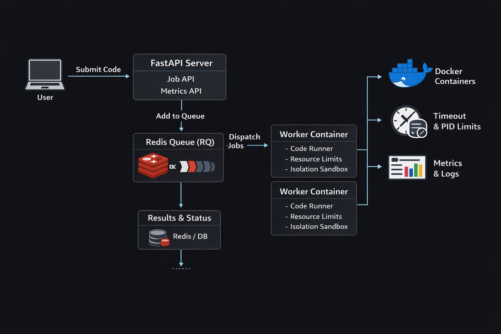

# Distributed Secure Code Execution Platform

A production-style distributed system that securely executes untrusted
user code using Docker containers, Redis queues, and worker
orchestration.

------------------------------------------------------------------------

## Key Features

-   Docker-based isolated execution
-   Distributed workers using Redis Queue (RQ)
-   Asynchronous job processing
-   Secure sandbox execution (no network, limited CPU/memory)
-   Automatic container cleanup before and after execution
-   Docker Compose based system orchestration
-   Retry mechanism for failed jobs

------------------------------------------------------------------------

## System Architecture

                     +-------------+
                     |    User     |
                     +-------------+
                            |
                            v
                   +----------------+
                   |   FastAPI API  |
                   |   (API Server) |
                   +----------------+
                            |
                            v
                     +------------+
                     |   Redis    |
                     |  (Queue)   |
                     +------------+
                            |
                  +---------+----------+
                  |                    |
                  v                    v
          +---------------+     +---------------+
          |   Worker 1    |     |   Worker 2    |
          +---------------+     +---------------+
                  |                    |
                  v                    v
          +---------------+     +---------------+
          | Docker Runner |     | Docker Runner |
          | Container     |     | Container     |
          +---------------+     +---------------+
                  |
                  v
          Execute User Code Safely

------------------------------------------------------------------------

## System Architecture

------------------------------------------------------------------------

## Architecture

The system consists of several components:

### 1. FastAPI API Server

Handles user requests and job submission.

### 2. Redis Queue

Stores jobs before execution and acts as a message broker.

### 3. Worker Processes

Consume jobs from the queue and execute them asynchronously.

### 4. Docker Containers

Provide sandboxed environments for running user code.

### 5. Observability Layer

Tracks logs, job execution status, and system behavior.

------------------------------------------------------------------------

## Execution Flow

1.  User submits code
2.  API validates request
3.  Job pushed to Redis Queue
4.  Worker picks job
5.  Worker launches isolated Docker container
6.  Code copied into container
7.  Code executed
8.  Output stored in Redis
9.  User fetches result

------------------------------------------------------------------------

## Prerequisites

### Install Docker

    sudo apt update
    sudo apt install docker.io -y
    sudo systemctl start docker
    sudo systemctl enable docker

Add user to docker group:

    sudo usermod -aG docker $USER
    newgrp docker

Verify installation:

    docker --version

------------------------------------------------------------------------

### Install Docker Compose

    sudo apt install docker-compose -y

Check version:

    docker compose version

------------------------------------------------------------------------

## Project Setup

    git clone https://github.com/<your-username>/<repo-name>.git
    cd <repo-name>

------------------------------------------------------------------------

## Build and Start the System

Build containers:

    docker compose build

Start the full system:

    docker compose up

This will start:

-   Redis
-   FastAPI API Server
-   Worker Service

------------------------------------------------------------------------

## Running Containers

Check running containers:

    docker ps

Expected containers:

-   code-execution-api
-   code-execution-worker
-   redis

------------------------------------------------------------------------

## API Usage

### Submit Code

    POST /submit-code

Example request:

    {
      "code": "print('Hello World')"
    }

------------------------------------------------------------------------

### Check Status

    GET /job-status/{job_id}

Example response:

    {
      "status": "completed",
      "output": "Hello World"
    }

------------------------------------------------------------------------

## Secure Execution

Each job runs inside an isolated Docker container.

Security restrictions include:

-   No internet access
-   Limited CPU usage
-   Limited memory allocation
-   Restricted filesystem access

These controls prevent malicious code from affecting the host system.

------------------------------------------------------------------------

## Cleanup Strategy

Before execution:

-   Temporary files removed
-   Clean execution environment prepared

After execution:

-   Files deleted
-   Containers reused or removed

------------------------------------------------------------------------

## Scaling Workers

Workers can be horizontally scaled.

Example:

    docker compose up --scale worker=3

This allows multiple jobs to execute in parallel.

------------------------------------------------------------------------

## Logs and Monitoring

View logs for all services:

    docker compose logs

View logs for a specific service:

    docker compose logs worker

------------------------------------------------------------------------

## Common Errors & Fixes

### Error: Port already allocated

    lsof -i :6379
    kill -9 <PID>

------------------------------------------------------------------------

### Docker permission denied

    sudo usermod -aG docker $USER
    newgrp docker

------------------------------------------------------------------------

### Containers not starting

Rebuild images:

    docker compose build --no-cache

------------------------------------------------------------------------

## Testing

Submit test code:

    print("Hello from container")

Expected output:

    Hello from container

------------------------------------------------------------------------

## Stop the System

    docker compose down

------------------------------------------------------------------------

## Author

Mayuri Mane\
Security Engineer \| Backend Developer

