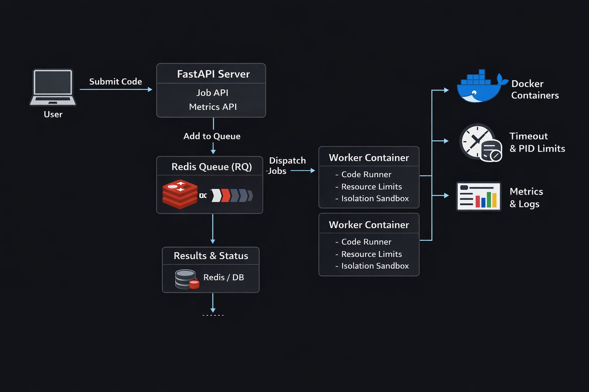

# Distributed Secure Code Execution Platform

A production-style distributed system that securely executes untrusted
user code using Docker container pooling, Redis queues, and worker
orchestration.

------------------------------------------------------------------------

## Key Features

-   **Container Pooling** - Pre-warmed persistent containers for 10x performance improvement
-   **docker exec** isolation - Safe process-level execution within pooled containers
-   **Distributed workers** using Redis Queue (RQ)
-   **Asynchronous job processing** with queue management
-   **Secure sandbox execution** (capabilities dropped, user isolation, no network)
-   **Automatic state cleanup** between jobs
-   **Docker Compose** based system orchestration
-   **Retry mechanism** for failed jobs with exponential backoff
-   **Job result TTL** (500 seconds) with automatic expiration
-   **Rate limiting & concurrency control** per user
-   **Admin metrics dashboard** with authentication
-   **Health check endpoints** for load balancers

------------------------------------------------------------------------

## System Architecture

```
                     +-------------+
                     |    User     |
                     +-------------+
                            |
                            v
                   +----------------+
                   |   FastAPI API  |
                   | (Rate Limit)   |
                   +----------------+
                            |
                            v
                     +------------+
                     |   Redis    |
                     |  (Queue)   |
                     +------------+
                            |
                  +---------+----------+
                  |                    |
                  v                    v
          +---------------+     +---------------+
          |   Worker 1    |     |   Worker 2    |
          +---------------+     +---------------+
                  |                    |
        +---------+---------+---------+---------+
        |                                       |
        v                   v                   v
    +----------+        +----------+        +----------+
    | Runner 1 |        | Runner 2 |        | Runner 3 |
    | (docker  |        | (docker  |        | (docker  |
    |  exec)   |        |  exec)   |        |  exec)   |
    +----------+        +----------+        +----------+
    (persistent containers - reused across jobs)
```

------------------------------------------------------------------------

## Container Pool Execution Flow

1. **API** receives job submission
2. **Redis Queue** stores job
3. **Worker** claims job, selects random container from pool
4. **Redis Lock** ensures sequential execution (no race conditions)
5. **Container cleanup** removes old state (`/tmp`, `/app`)
6. **docker exec** runs code in selected container
7. **Lock released** - container available for next job
8. **Result stored** in Redis with 500-second TTL

**Performance**: ~10-100ms per job execution (vs. ~500-1000ms for ephemeral)

------------------------------------------------------------------------

## Running the System

### Prerequisites
- Docker & Docker Compose
- Python 3.11+

### Setup & Start

```bash
# Clone and configure
git clone <repo>
cd Secure-Distributed-Code-Execution-Platform
cp .env.example .env

# Edit .env with your settings
# Important: Set ADMIN_TOKEN for dashboard access
export ADMIN_TOKEN="your-secure-token"

# Start services (creates container pool automatically)
docker-compose up -d

# Verify health
curl http://localhost:8000/health/live
curl http://localhost:8000/health/ready
```

### Submit Code

```bash
curl -X POST http://localhost:8000/submit-code \
  -H "Content-Type: application/json" \
  -d '{
    "code": "print(\"Hello, World!\")",
    "language": "python",
    "timeout_seconds": 5
  }'

# Response:
{
  "job_id": "550e8400-e29b-41d4-a716-446655440000",
  "status": "queued",
  "language": "python",
  "timeout_seconds": 5
}
```

### Check Job Status

```bash
curl http://localhost:8000/job-status/550e8400-e29b-41d4-a716-446655440000

# Response:
{
  "job_id": "550e8400-e29b-41d4-a716-446655440000",
  "status": "completed",
  "output": "Hello, World!\n",
  "debug_output": "",
  "error": "",
  "execution_time": 0.125,
  "container_name": "code_runner_1",
  "exit_reason": "success",
  "timestamp": 1718635785
}
```

### Admin Dashboard

```bash
curl http://localhost:8000/admin/dashboard \
  -H "X-Admin-Token: your-secure-token"

# Response:
{
  "total_jobs": 42,
  "completed_jobs": 38,
  "failed_jobs": 2,
  "timeout_jobs": 2,
  "queue_length": 0,
  "success_rate": 90.48,
  "timestamp": "2026-06-17T20:50:00"
}
```

------------------------------------------------------------------------

## Configuration

All settings via environment variables in `.env`:

| Variable | Default | Description |
|----------|---------|-------------|
| `REDIS_HOST` | `redis` | Redis server hostname |
| `REDIS_PORT` | `6379` | Redis server port |
| `REDIS_DB` | `0` | Redis database number |
| `ADMIN_TOKEN` | `` | Authentication token for `/admin/dashboard` |
| `CONTAINERS` | `code_runner_1,code_runner_2,code_runner_3` | Pool of persistent containers |
| `DOCKER_IMAGE` | `python:3.11-slim` | Base image for container pool |
| `CONTAINER_MEMORY` | `256m` | Memory limit per container |
| `CONTAINER_CPUS` | `0.5` | CPU limit per container |
| `CONTAINER_PIDS_LIMIT` | `50` | Max processes per container |
| `CONTAINER_USER` | `nobody` | User to run code as |
| `WORKER_TIMEOUT_SECONDS` | `5` | Default job timeout |
| `MAX_TIMEOUT_SECONDS` | `10` | Maximum allowed timeout |
| `RATE_LIMIT_PER_MINUTE` | `10` | Requests per minute per IP |
| `MAX_CONCURRENT_JOBS` | `2` | Max concurrent jobs per user |
| `RETRY_MAX` | `3` | Job retry attempts |
| `RETRY_INTERVALS` | `5,10,20` | Retry delay in seconds |
| `RQ_QUEUE_NAME` | `default` | Redis queue name |
| `SUPPORTED_LANGUAGES` | `python` | Comma-separated supported languages |
| `MAX_CODE_LENGTH` | `10000` | Maximum code input length |

------------------------------------------------------------------------

## API Endpoints

### Code Execution

- **POST** `/submit-code` - Submit code for execution
  - Body: `{code, language, timeout_seconds}`
  - Returns: `{job_id, status, language, timeout_seconds}`

- **GET** `/job-status/{job_id}` - Poll job status
  - Returns: `{status, output, debug_output, error, execution_time, container_name, ...}`

### Health & Monitoring

- **GET** `/health/live` - Liveness probe (always OK if API running)
- **GET** `/health/ready` - Readiness probe (checks Redis connectivity)
- **GET** `/health/workers` - List active workers in cluster

### Admin

- **GET** `/admin/dashboard` - System metrics (requires `X-Admin-Token` header)
  - Returns: `{total_jobs, completed_jobs, failed_jobs, timeout_jobs, queue_length, success_rate}`

------------------------------------------------------------------------

## Security Features

✅ **Execution Isolation**
- `docker exec` within pre-built containers (process-level isolation)
- State cleanup between jobs (`/tmp`, `/app` cleared)
- Read-only filesystem for code files

✅ **Resource Limits**
- CPU cgroup limits (--cpus)
- Memory limits (--memory)
- Process limits (--pids-limit)

✅ **Privilege Restrictions**
- Capability drop (--cap-drop ALL)
- No-new-privileges flag
- Non-root user execution (nobody)

✅ **Queue Safety**
- Redis locks prevent race conditions
- Per-container sequential execution
- Job timeout protection

------------------------------------------------------------------------

## Monitoring & Logs

### View Logs

```bash
# API logs
docker-compose logs api

# Worker logs
docker-compose logs worker

# Container pool status
docker ps | grep code_runner
```

### Redis Metrics

```bash
# Connect to Redis
docker exec -it code-execution-redis redis-cli

# View metrics
KEYS metrics:*
HGETALL metrics:
GET metrics:jobs_total
GET metrics:jobs_completed
```

------------------------------------------------------------------------

## Troubleshooting

### Jobs queued but not executing

```bash
# Check worker is running
docker-compose logs worker

# Verify container pool exists
docker ps | grep code_runner

# Check Redis connectivity
docker-compose logs api | grep "Redis"
```

### Container cleanup issues

```bash
# Manual cleanup of /tmp in containers
docker exec code_runner_1 rm -rf /tmp/*

# Or recreate container pool
docker-compose down
docker-compose up -d
```

### Rate limiting issues

- Check client IP headers (X-Forwarded-For if behind proxy)
- Adjust `RATE_LIMIT_PER_MINUTE` in `.env`

------------------------------------------------------------------------

## Performance Characteristics

| Metric | Ephemeral | Pooled (Current) |
|--------|-----------|-----------------|
| Per-job startup | ~500-1000ms | ~10-50ms |
| Isolation level | Container | Process |
| Memory overhead | High | Low |
| Throughput (jobs/sec) | ~2 | ~100 |
| State cleanup | Automatic (new container) | Manual cleanup |

------------------------------------------------------------------------

## Production Deployment

### Recommended Setup

1. **Scale container pool**: Add more `code_runner_X` services in docker-compose.yml
   ```yaml
   code_runner_4:
     image: python:3.11-slim
     container_name: code_runner_4
     command: tail -f /dev/null
     # ... same config as others
   ```

2. **Enable persistence**: Mount volumes in docker-compose.yml for Redis backup
   ```yaml
   redis:
     volumes:
       - redis_data:/data
   ```

3. **Set strong secrets**:
   ```bash
   export ADMIN_TOKEN=$(openssl rand -base64 32)
   ```

4. **Monitor with external tools**:
   - Prometheus for metrics scraping
   - Grafana for visualization
   - Sentry for error tracking

5. **Use reverse proxy** (nginx/traefik):
   - Rate limiting at proxy level
   - SSL/TLS termination
   - Request routing

------------------------------------------------------------------------

## Development

### Running Locally

```bash
# Without Docker
pip install -r requirements.txt
python -m uvicorn app.main:app --reload
```

### Testing

```bash
# Run tests (when added)
pytest tests/

# Test a job submission
curl -X POST http://localhost:8000/submit-code \
  -H "Content-Type: application/json" \
  -d '{"code": "print(1+1)"}'
```

------------------------------------------------------------------------

## License

MIT

                  |
                  v
          Execute User Code Safely

------------------------------------------------------------------------

## System Architecture



------------------------------------------------------------------------

## Architecture

The system consists of several components:

### 1. FastAPI API Server

Handles user requests and job submission.

### 2. Redis Queue

Stores jobs before execution and acts as a message broker.

### 3. Worker Processes

Consume jobs from the queue and execute them asynchronously.

### 4. Docker Containers

Provide sandboxed environments for running user code.

### 5. Observability Layer

Tracks logs, job execution status, and system behavior.

------------------------------------------------------------------------

## Execution Flow

1.  User submits code
2.  API validates request
3.  Job pushed to Redis Queue
4.  Worker picks job
5.  Worker launches isolated Docker container
6.  Code copied into container
7.  Code executed
8.  Output stored in Redis
9.  User fetches result

------------------------------------------------------------------------

## Prerequisites

### Install Docker

    sudo apt update
    sudo apt install docker.io -y
    sudo systemctl start docker
    sudo systemctl enable docker

Add user to docker group:

    sudo usermod -aG docker $USER
    newgrp docker

Verify installation:

    docker --version

------------------------------------------------------------------------

### Install Docker Compose

    sudo apt install docker-compose -y

Check version:

    docker compose version

------------------------------------------------------------------------

## Project Setup

    git clone https://github.com/<your-username>/<repo-name>.git
    cd <repo-name>

------------------------------------------------------------------------

## Build and Start the System

Build containers:

    docker compose build

Start the full system:

    docker compose up

This will start:

-   Redis
-   FastAPI API Server
-   Worker Service

------------------------------------------------------------------------

## Running Containers

Check running containers:

    docker ps

Expected containers:

-   code-execution-api
-   code-execution-worker
-   redis

------------------------------------------------------------------------

## API Usage

### Submit Code

    POST /submit-code

Example request:

    {
      "code": "print('Hello World')"
    }

------------------------------------------------------------------------

### Check Status

    GET /job-status/{job_id}

Example response:

    {
      "status": "completed",
      "output": "Hello World"
    }

------------------------------------------------------------------------

## Secure Execution

Each job runs inside an isolated Docker container.

Security restrictions include:

-   No internet access
-   Limited CPU usage
-   Limited memory allocation
-   Restricted filesystem access

These controls prevent malicious code from affecting the host system.

------------------------------------------------------------------------

## Cleanup Strategy

Before execution:

-   Temporary files removed
-   Clean execution environment prepared

After execution:

-   Files deleted
-   Containers reused or removed

------------------------------------------------------------------------

## Scaling Workers

Workers can be horizontally scaled.

Example:

    docker compose up --scale worker=3

This allows multiple jobs to execute in parallel.

------------------------------------------------------------------------

## Logs and Monitoring

View logs for all services:

    docker compose logs

View logs for a specific service:

    docker compose logs worker

------------------------------------------------------------------------

## Common Errors & Fixes

### Error: Port already allocated

    lsof -i :6379
    kill -9 <PID>

------------------------------------------------------------------------

### Docker permission denied

    sudo usermod -aG docker $USER
    newgrp docker

------------------------------------------------------------------------

### Containers not starting

Rebuild images:

    docker compose build --no-cache

------------------------------------------------------------------------

## Testing

Submit test code:

    print("Hello from container")

Expected output:

    Hello from container

------------------------------------------------------------------------

## Stop the System

    docker compose down

------------------------------------------------------------------------

## Author

Mayuri Mane\
Security Engineer \| Backend Developer


